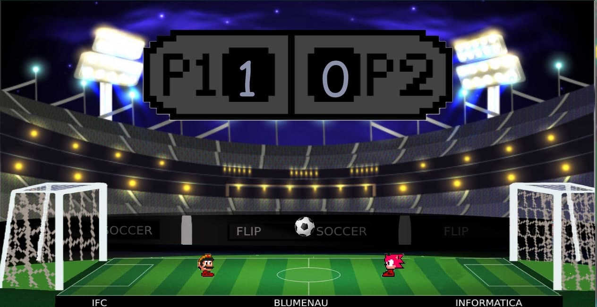

<h1>Flip Soccer</h1>
 
<h3>Jogo de futebol no estilo "Head Soccer" criado com python e arcade para dois jogadores simutaneamente.</h3>

<h4>menu do jogo </h4>
 

<h4>cenário do jogo </h4>
 

<h4>Game over</h4>
 

 

<h4>Criadores: Benlove Anelus, Gabriel João Rosa, Nickolas Guinter e Gregóry Antunes </h4>

<h3>Requisitos: </h3>
<ul>
	<li>Python versão 3.8 ou superior (<a href="https://www.python.org/downloads/">Link para download</a>)</li>
  <li>Arcade na versão 2.1.7 (<a href="http://arcade.academy/">Documentação da biblioteca</a>)</li>

</ul>
